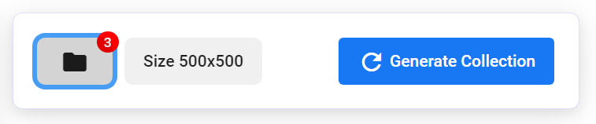

# Groups + 1/1s

You can use AutoMinter to create groups add 1/1s in your collection. For example, you may want Robots and Apes to appear in your collection, but layers for Robots should not be mixed with ape layers.\
\
1/1s are individual NFTs which are not composed of layers, simply individual images to be added to the same collection.\
\
To create these, you must create a group in the collection editor. These are treated as separate generations and are combined into the same collection. When you generate your artwork, you must specify the number to be generated from each group.

.png>)
