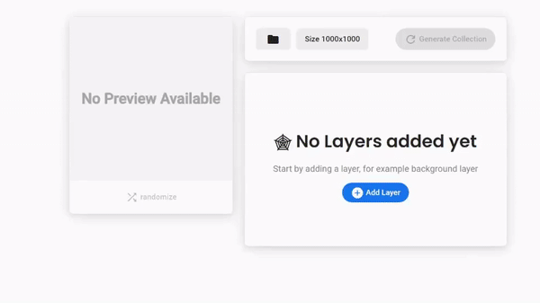

# Uploading Images

## The Basics

Each NFT in our collection will be made up of different layers. For example each image may be made up of eyes, glasses, a hat, and different backgrounds.

Each NFT is generated by combining a random combination of these layers, based on how rare we set each layer to be.

## Preparing Image Layers for AutoMinter

You can design image layers in any image editing app. The important thing is make sure that each layer is exported with a transparent background as a PNG.

The recommended size for your image layers is 500x500 but you can choose anything up to 1200x1200

## Upload similar images to the same layer

You should upload each image into AutoMinter into the same layer. For example all "Hats" should be uploaded to the same layer. You can reorder the layers by selecting "move up" or "move down" from the menu on the layer.
