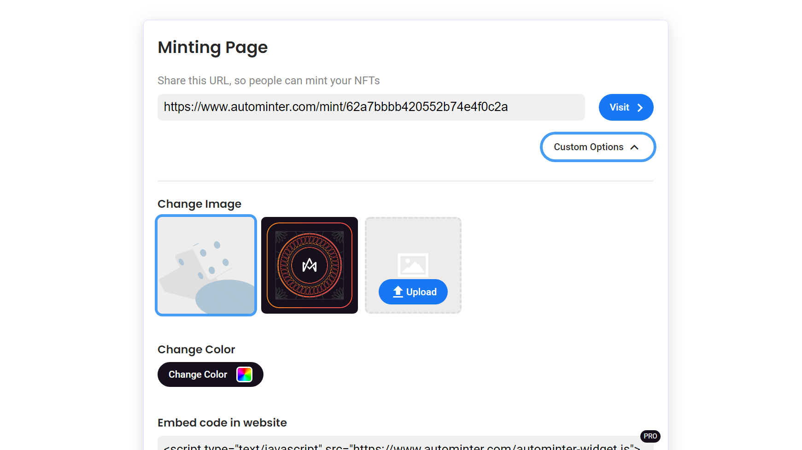

# Quick Start

This page summarizes all the essential things you need to know to start using AutoMinter. Here you can find all the best practices and tips to setup and launch your NFT collection.

## Sign in with a wallet

In order to use AutoMinter, you'll need a crypto wallet. You'll most likely install either a browser extension (like metamask) or connect with a mobile wallet in an app.

.png>)

To learn to setup and connecting your wallet:&#x20;

## Collection Designer

When you create an NFT project in AutoMinter you will see the collection editor. Here you can upload the layer images that will make up your NFTs. As well as be able to configure thing like rarity and metadata. This is where you will generate your final artwork.

## Adding to the blockchain

Once you're artwork has been generated, it must be added to the blockchain, which is turning your collection into actual NFTs. In this step you will have the option to customise your deployment to suite your project

.png>)

## Collection Manager

Once your collection is on the blockchain you will be able to manage it from within AutoMinter. Here you can do such things as send "Airdrops", manage who is able to mint, and reveal the artwork if you chose to delay the revealing of the artwork.

.png>)

## Minting

Once you're NFT collection is finalised. People must make an initial purchase known as "Minting". There are multiple ways that people can mint, including from the dedicated web pages provided by AutoMinter, or Buttons which you can add to your own website.

## Whitelists

AutoMinter Lists is a separate stand-alone tool for collecting wallets for early access to your NFT drops. You can use it to both create exclusivity and remove bots so you can ensure your NFTs are purchased by real humans.

