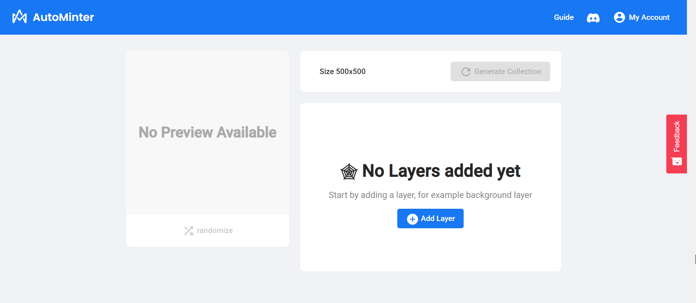

# Creating Your First Project

## Connect your wallet

To create your NFT collection, you will need to have an Crypto Wallet. If you do not have a wallet yet, you can read the [Crypto wallet fundamentals](../fundamentals/ethereum-wallets/). We recommend using MetaMask for desktop browsers if you don't yet have one.


[metamask.md](../fundamentals/ethereum-wallets/metamask.md)



[wallet-connect.md](../fundamentals/ethereum-wallets/wallet-connect.md)



[coinbase-wallet.md](../fundamentals/ethereum-wallets/coinbase-wallet.md)


## Creating a project

Hit the big '+ Create Project' button once you have signed in to create a new project

## The project editor

Once you've created your project you will see an empty project editor. There will be a preview image on the left, for viewing previews of your NFTs.

On the right you will see the layer panes, where we will upload the different image layers of our image.

